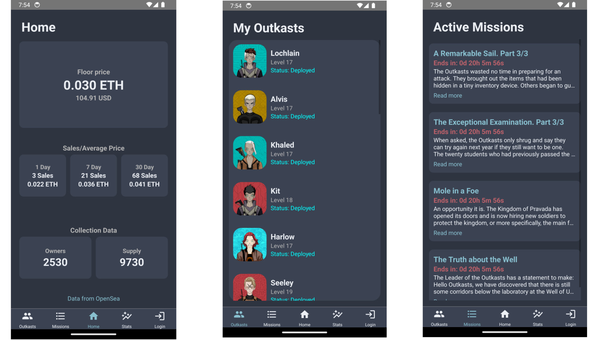

# Pocket Outkasts

Pocket Outkasts is an Android app designed for the community of Outkast holders. It provides a convenient way to view your Outkasts, track ongoing missions, keep up with the lore, and monitor the status of individual Outkasts, such as their deployment on missions.

## Features

- **View Your Outkasts**: Easily access and view all your Outkasts in one place.
- **Track Missions**: Stay updated on ongoing missions and their progress.
- **Lore Exploration**: Dive into the rich lore of the Outkasts universe.
- **Outkast Status**: Check whether your Outkasts are deployed on missions and monitor their status.

## Getting Started

To get started with Pocket Outkasts, follow these simple steps:

1. Download the app from the Google Play Store.
2. Log in with your Outkast account.
3. Start exploring your Outkasts, missions, and lore!

## Contributing

We welcome contributions to Pocket Outkasts! If you have ideas for new features or improvements, please open an issue or submit a pull request.

## License

Pocket Outkasts is licensed under the MIT License. See the [LICENSE](LICENSE) file for more details.
